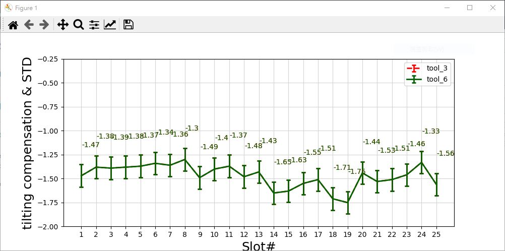

# Standard-Deviation-python-plot
clone and change data set, the original code has error but able to manage and fixed

code fixed
```
#%matplotlib notebook
'exec(%matplotlib inline)'

##matplotlib.rc('font', **font)
plt.rc('font', **font)

```

original code posted, https://towardsdatascience.com/using-standard-deviation-in-python-77872c32ba9b

Python 3.7.3 used  
```
Python 3.7.3 (v3.7.3:ef4ec6ed12, Mar 25 2019, 21:26:53) [MSC v.1916 32 bit (Intel)] on win32  
Type "help", "copyright", "credits" or "license" for more information.  
>>>  
```

install libraries first
```
pip install jupyter ipython pandas matplotlib
```

run the python code  
```
python -m std.py
```

the result  

  
